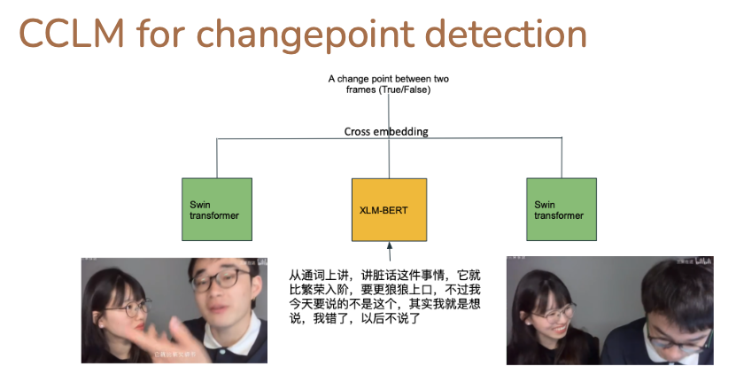
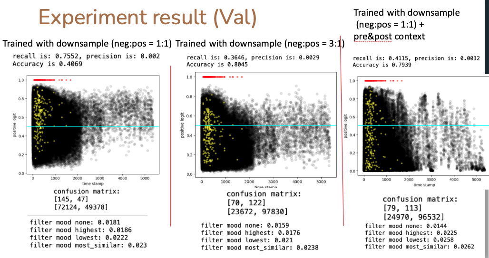
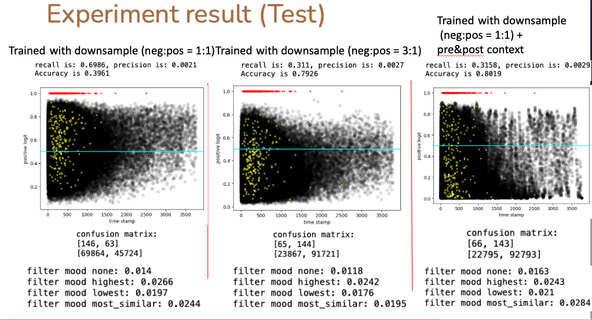

# CCLM for change point detection

## Overview
This repo is an experiment from Columbia CCU that uses a pretrained [CCLM model](https://arxiv.org/abs/2206.00621) to detect changepoints in conversations using both visual and textual input.  




## 1. How to Install

### Requirements
- Install python3 environment.
```python 
pip3 install -r requirements.txt
```
- Install pretrained CCLM checkpoint form [initial CCLM repo](https://github.com/zengyan-97/CCLM) and save the wights into following path. (CCLM-4M is mainly used in this experiment)
```
\data\cclm_4m_epoch_29.th
```

### Description of Codes
- `train_cls_head.py` -> Load pretrained CCLM encoder and train cls head for changepoint detection.(Pretrained CCLM encoder are freezed at this step.)
- `fine_tune.py` -> Finetune the whole model including the pretrained CCLM encoder.
- `inference.py` -> Make predictions on validation dataset.


## 2. Dataset
The dataset is saved in a dictionary and only includes paths to specific files. In order to load the required data, you need to connect to CU machines.
Sepecifically, you can use Amith's saved cache: `/mnt/swordfish-pool2/ccu/amith-cache.pkl`
Alternatively, you can refer to [Amith's data loader function](https://github.com/amith-ananthram/columbia-ccu/tree/main/loaders) to create your own cached dataset.

## 3. Argument Description.

```python
# origin data dict created by loader function
parser.add_argument("-dsp", "--dataset_path", default = '/mnt/swordfish-pool2/ccu/amith-cache.pkl')

# train batchsize
parser.add_argument("-tbs", "--train_batch_size", type = int, default = 50)

# evaluation batchsize (calculate accuracy and recall at the end of each epoch)
parser.add_argument("-ebs", "--eval_batch_size", type = int, default = 512)

parser.add_argument("-ne", "--num_epochs", type = int, default = 20)

# 0 = not use context, 1 = use context 
parser.add_argument("-uc", "--use_context", type = int, default = 1)

parser.add_argument("-lr", "--lr", type = float, default = 0.00002)

# only load utterance transcribed by specific model. pick one form ['whisper','wav2vec','azure']
parser.add_argument("-tn", "--transcribe_name", type = str, default = 'whisper')

# GPU you want to use, input string like '1,2,4' (using 3 GPUs)
parser.add_argument("-gpu", "--gpu_index", required=True)

# Down sample ratio you are using when constructing a training dataset
parser.add_argument("-npr", "--neg_pos_rate", type=float, required= True)

# if you are finetuing input your trained CCLM model with cls head.
parser.add_argument("-tchm", "--trained_cls_head_model", type = str, default = '/mnt/swordfish-pool2/kh3074/neg_pos_rate2/trained_cls_head_model/model_tuned_epoch_44')

# top 3 models with highest pr-auc are saved to this path
parser.add_argument("-msd", "--model_save_dir",  default = '/mnt/swordfish-pool2/kh3074/neg_pos_rate2/saved_models')

# training loss and results in every epoch are saved to this path
parser.add_argument("-rsd", "--result_save_dir", default = '/mnt/swordfish-pool2/kh3074/neg_pos_rate2/evaluate_results')
```

A sample for you to use three listed py code:
```
python3 train_cls_head.py -dsp path/to/pkl/dataset -tbs 1024 -ebs 2048 -ne 100 -lr 0.0002 -uc 1 -tn whisper -gpu 1,2,3,4 -npr 1 - msd path/to/save/top3/models -rsd path/to/save/epoch/result

python3 fine_tune.py -dsp path/to/pkl/dataset -tbs 256 -ebs 2048 -ne 20 -lr 0.0001 -uc 1 -tn whisper -gpu 1,2,3,4 -npr 1 - msd path/to/save/top3/models -rsd path/to/save/epoch/result

python3 inference.py -dn INTERNAL_VAL -dsp path/to/pkl/dataset -bs 2048 -gpu 1,2,3,4 -uc 1 -part 2 -msp path/to/your/trained/model -rsd path/to/save/predicted/results
```

## 4. Notebooks
Check out the notebooks if you want! They'll show you through our data loading and training loops.

## 5. Current results. 

  


